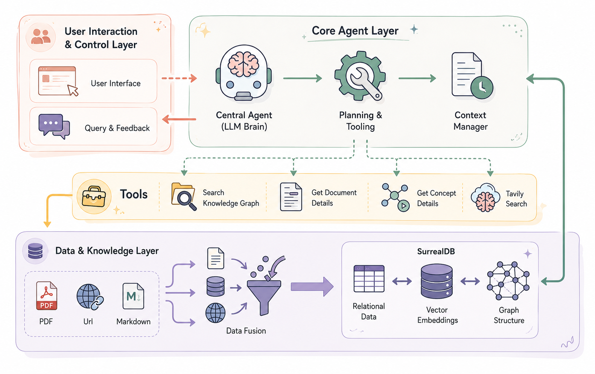
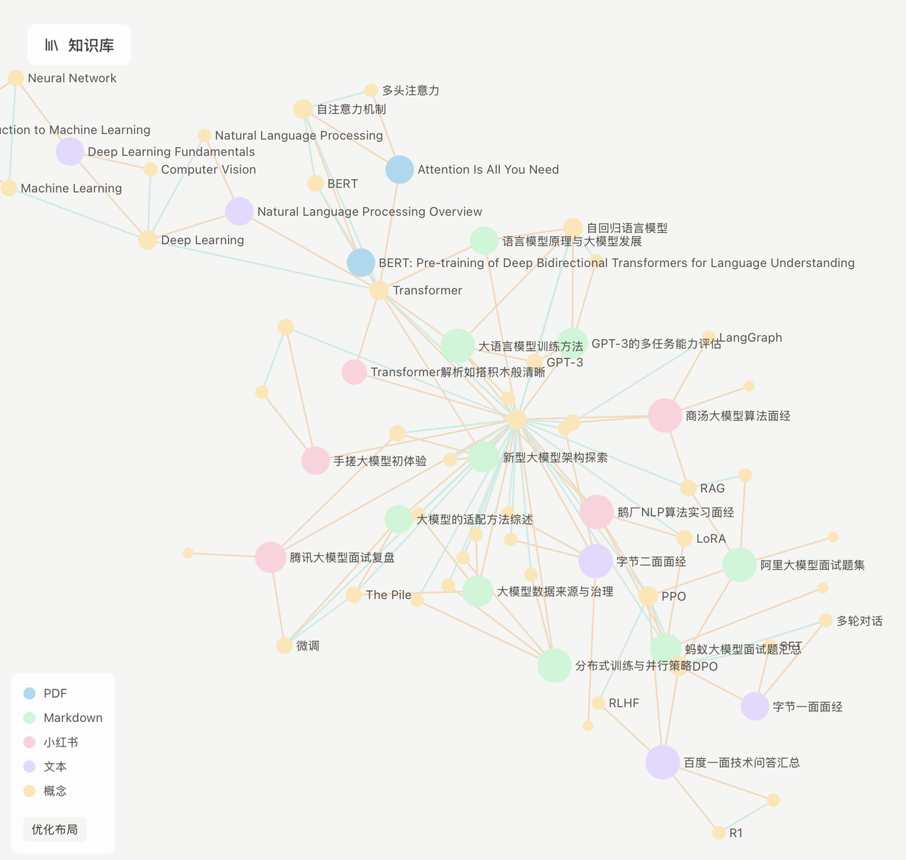
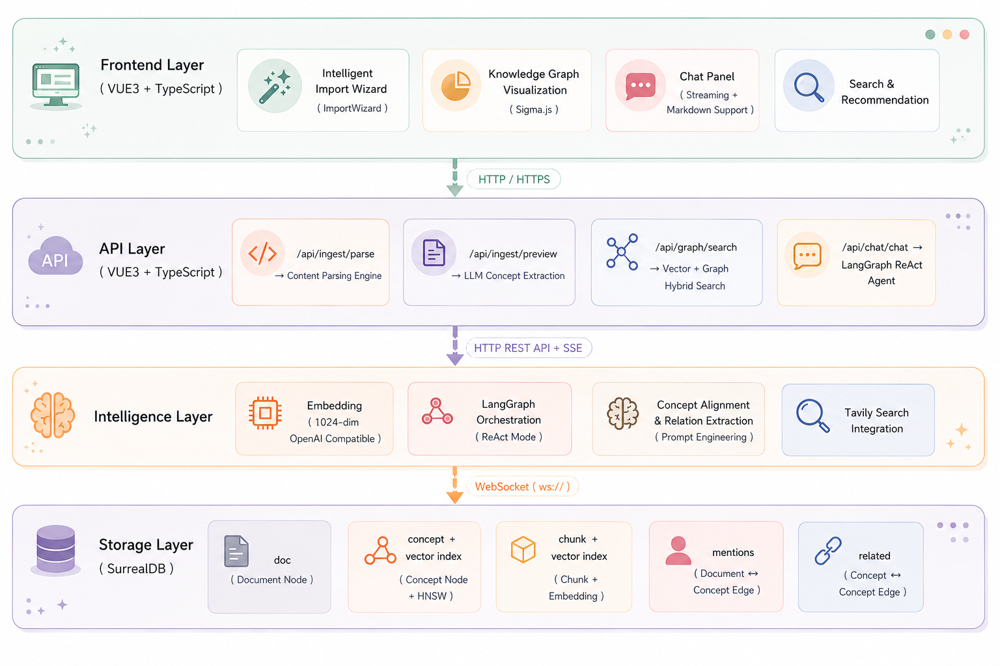
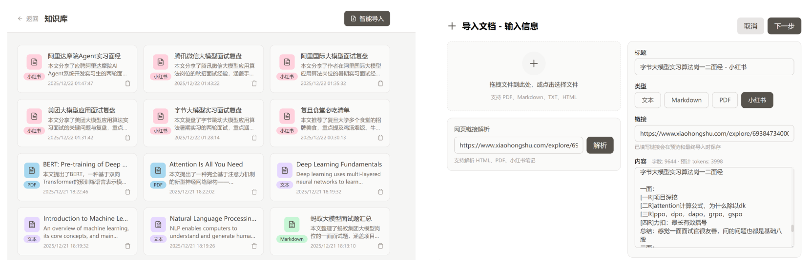
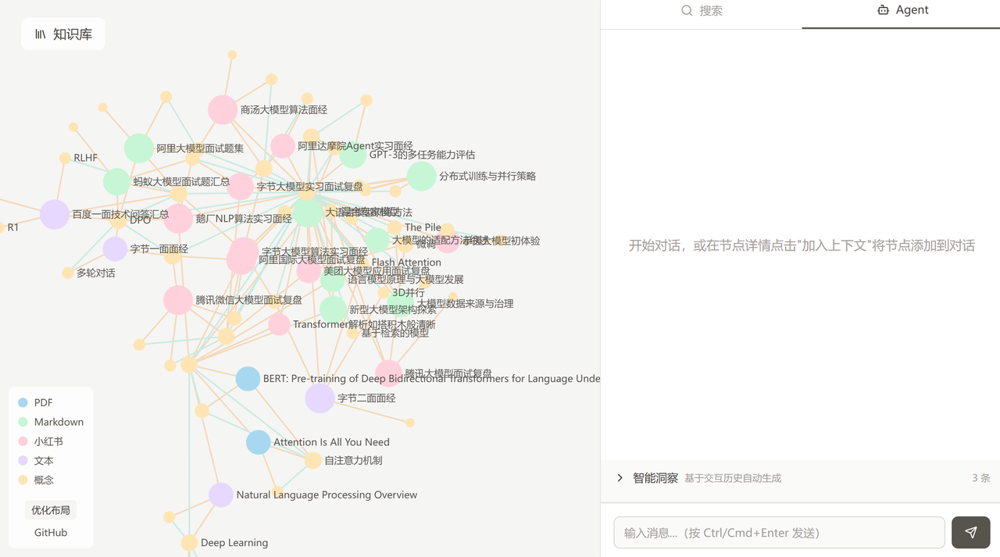
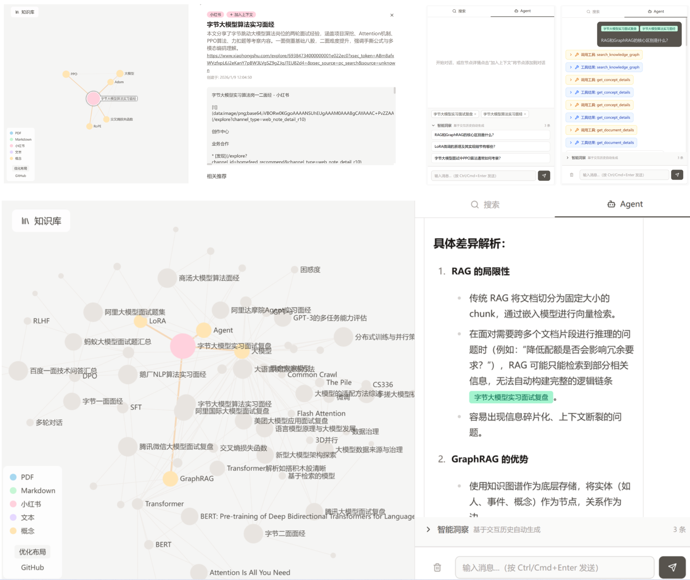

# MarkMind

> 基于知识图谱与 Agent 驱动的个人知识库系统

---

## 🧠 项目简介



MarkMind 是一个面向个人知识管理场景构建的智能知识库系统，核心目标是解决传统知识管理工具中常见的信息碎片化、知识关联断裂以及复杂内容难以回溯的问题。系统以知识图谱作为底层组织结构，并结合 Agent 推理机制，实现知识的结构化组织、关联探索与智能问答。

---

# ✨ 系统特点

## 🌊 图谱化知识组织



系统会自动从文档中提取概念与关系，并逐步构建知识图谱，使原本孤立的文本内容形成可关联、可探索的知识网络。用户不仅能够搜索内容，还能够沿着知识关系进一步发现潜在关联。

---

## 🤖 Agent 驱动的动态推理

系统引入基于 LangGraph 的 Agent 推理框架，根据问题复杂度动态选择检索与推理路径。对于简单问题，系统会直接进行语义检索；而对于复杂问题，则会结合图谱关系进行多跳推理，从而提升跨文档问题下的回答能力。

---

# 🏗️ 系统架构



---

# 🚀 核心工作流程

系统支持 PDF、Markdown、TXT 以及网页内容等多种数据导入方式。导入后会自动完成文本解析、语义切分与知识抽取，并逐步构建知识图谱。

在问答过程中，系统不仅生成回答，还会结合图谱结构展示相关知识节点，帮助用户理解不同概念之间的逻辑关系。








---

# ⚙️ 技术栈

```text
Frontend:
Vue3 + TypeScript + Sigma.js

Backend:
Python + FastAPI + LangGraph

Database:
SurrealDB

AI:
LLM + GraphRAG + Agent Workflow
```

---

# 📂 项目结构

```text
MarkMind_Agent_System
├── client/
├── server/
├── markmind.db/
├── assets/
└── README.md
```

---

# 🖥️ Run the Project

## Terminal 1 — Server:

```bash
cd server
uv sync
uv run fastapi dev main.py
```

## Terminal 2 — Client:

```bash
cd client
pnpm install
pnpm dev
```

启动完成后，在本地浏览器即可访问系统。

### 1. 安装依赖

使用 uv（推荐）:
```bash
uv sync
```

或使用 pip:
```bash
pip install -e .
```

### 2. 配置环境变量

复制 `.env.example` 到 `.env` 并配置：

```bash
cp .env.example .env
```

编辑 `.env` 文件，设置你的 OpenAI API 配置。

如果你有 Tavily 实例并想让 Agent 能调用 Tavily，请在 `.env` 中设置：

```dotenv
TAVILY_ENABLED=true
TAVILY_API_KEY=your_key_here
TAVILY_HOST=https://api.tavily.example
```

### 3. 启动 SurrealDB

```bash
surreal start --log trace --user root --pass root memory
```

或使用文件存储:
```bash
surreal start --log trace --user root --pass root file://markmind.db
```

### 4. 初始化数据库

```bash
python -m app.init_db
```

这会创建数据库表结构并插入测试数据。

### 5. 启动 server

```bash
cd server
fastapi dev main.py -- port 8080
```

服务将在 http://localhost:8080 启动。

### 6. 启动 client

```bash
cd client
pnpm install
pnpm dev
```

启动完成后，在本地浏览器即可访问系统。