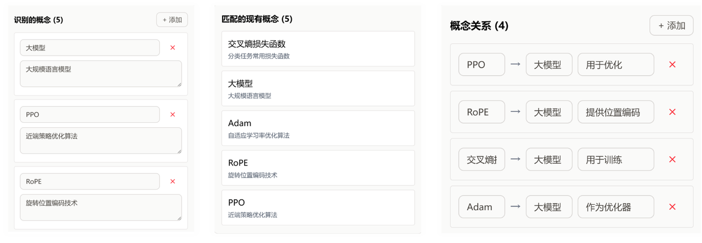

# MarkMind

> 基于知识图谱与 Agent 驱动的个人知识库系统

---

## 🧠 项目简介


MarkMind 是一个面向个人知识管理场景构建的智能知识库系统，核心目标是解决传统知识管理工具中常见的信息碎片化、知识关联断裂以及复杂内容难以回溯的问题。系统以知识图谱作为底层组织结构，并结合 Agent 推理机制，实现知识的结构化组织、关联探索与智能问答。

---

# ✨ 系统特点

## 🌊 图谱化知识组织


系统会自动从文档中提取概念与关系，并逐步构建知识图谱，使原本孤立的文本内容形成可关联、可探索的知识网络。用户不仅能够搜索内容，还能够沿着知识关系进一步发现潜在关联。

---

## 🤖 Agent 驱动的动态推理

系统引入基于 LangGraph 的 Agent 推理框架，根据问题复杂度动态选择检索与推理路径。对于简单问题，系统会直接进行语义检索；而对于复杂问题，则会结合图谱关系进行多跳推理，从而提升跨文档问题下的回答能力。

---

# 🏗️ 系统架构


---

# 🚀 核心工作流程

系统支持 PDF、Markdown、TXT 以及网页内容等多种数据导入方式。导入后会自动完成文本解析、语义切分与知识抽取，并逐步构建知识图谱。

在问答过程中，系统不仅生成回答，还会结合图谱结构展示相关知识节点，帮助用户理解不同概念之间的逻辑关系。





---

# ⚙️ 技术栈

```text
Frontend:
Vue3 + TypeScript + Sigma.js

Backend:
Python + FastAPI + LangGraph

Database:
SurrealDB

AI:
LLM + GraphRAG + Agent Workflow
```

---

# 📂 项目结构

```text
MarkMind_Agent_System
├── client/
├── server/
├── markmind.db/
├── assets/
└── README.md
```

---

# 🖥️ Run the Project

### 1. 启动数据库（SurrealDB）
建议在**项目根目录**启动，并使用**本地持久化存储**，避免重启后丢数据：

```bash
cd /Users/starry/Downloads/MarkMind_Agent_System
surreal start --log info --user root --pass root rocksdb://markmind.db
```

说明：

- 数据库服务监听在：`127.0.0.1:8000`
- 数据会持久化保存到项目根目录下的 `markmind.db`
- 以后请尽量在**同一个目录**下使用同一条命令启动，这样会一直连接同一份本地数据库

### 2. 启动后端（FastAPI）
新开一个终端：

```bash
cd /Users/starry/Downloads/MarkMind_Agent_System/server
source .venv/bin/activate
uv run uvicorn main:app --reload --port 8080
```

说明：

- 后端 API 地址：`http://127.0.0.1:8080`
- 当前前端默认会请求：`http://127.0.0.1:8080/api`

### 3. 启动前端（Vite）
再新开一个终端：

```bash
cd /Users/starry/Downloads/MarkMind_Agent_System/client
pnpm install
pnpm dev
```

说明：

- 前端开发地址通常是：`http://localhost:5173`

### 4. 启动顺序
推荐按下面顺序启动：

1. **先启动数据库**
2. **再启动后端**
3. **最后启动前端**
